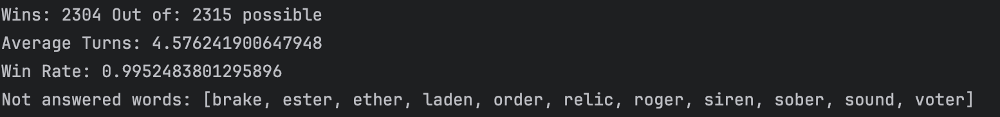
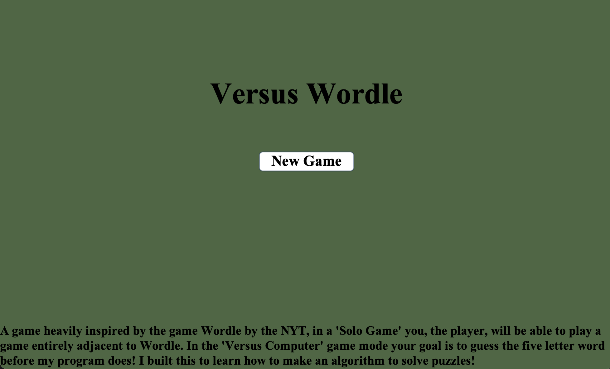
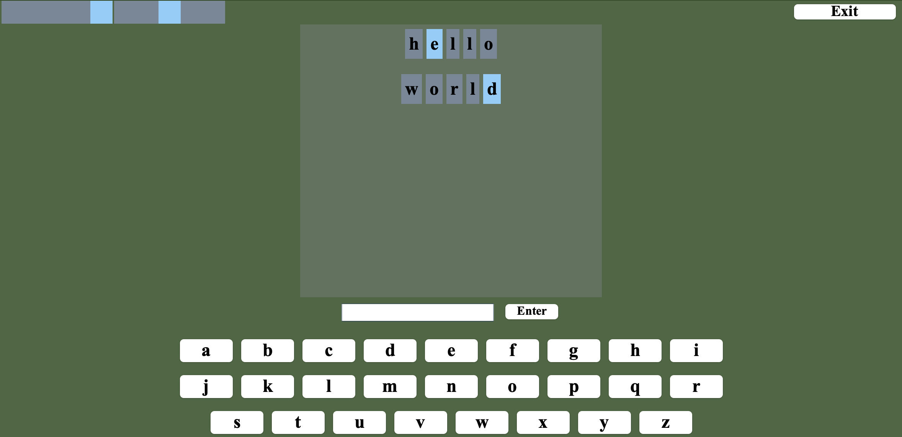
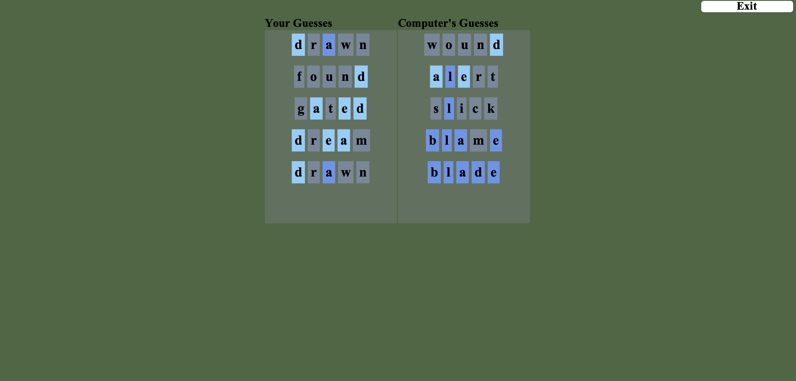

# **Versus Wordle**
#### by: Matthew Dahlgren

**1** [Game Modes and Features:](#game-modes-and-features)
- [Features](#features)
- [Versus Computer](#versus-computer)
- [Game Report](#game-report)

**2** [App Launching Instructions:](#app-launching-instructions)

**3** [Explanation of Classes](#explanation-of-classes)

**4** [Algorithm Success Rate](#algorithm-success-rate)

**5** [Images](#images)

**6** [Contribution](#contribution)

**7** [Resource Credits](#resource-credits)

## Game Modes and Features
### Features
- A functioning app that allows you to play Wordle against a computer.
- End of game report that displays the user's and the computer's guesses.
- A fully interactive GUI.

### Versus Computer
Play a game of Wordle versus an algorithm that I created. This algorithm chooses the "optimal guess" at any turn by
verifying letter and bigram frequencies in the remaining answer bank in an effort to either guess the word or remove
the most amount of possible guesses from the answer pool. A player can type their guess using their keyboard, or can use
the keyboard provided to them on the GUI. As you progress through a game you can see the progress that the computer is
making at the top of your screen.

### Game Report
The player can see what guesses they made during the game and the guesses that the computer had made to get to the end 
screen.

## App Launching Instructions
- Run with Java 22. Built and Tested on macOS Sequoia.
- Utilize Maven to install needed dependencies.
- Run [Main.java](./src/main/java/app/Main.java)

If Maven construction fails, a common fix is to  navigate to Maven in your Setting's Build Tools, select "Runner" and
then tick the checkbox to delegate IDE build/run actions to Maven.

## Explanation of Classes

The [AppBuilder](./src/main/java/app/AppBuilder.java) which implements the Builder design pattern to build the structure
of the app whenever the [main](./src/main/java/app/Main.java) is run. As this project is built to strictly adhere to 
Clean Architecture, the modules that are build from AppBuilder are use cases and views. 

[Views](./src/main/java/view) outline the GUI elements which do not contain any logic. The logic of this program is
called from Controllers of use cases. Each use case has an interactor that takes input data from the user and 
data from the in game memory, to produce output data for the use case's presenter to then relay a view model back to the
UI. 

[Words](./src/main/java/entities/Word.java) represents a word that is able to be guessed in a wordle game and stores 
[Letters](./src/main/java/entities/Letter.java) which allow the algorithm to grab and set the status of letters in the 
words to either remove them from the possible guess bank, and collecting frequencies of letters and bigrams to 
score and guess.

## Algorithm Success Rate:

The current implementation of the algorithm (wins refers to successions):

## Images

The Main Menu View

In-Game View

End of Game Report View (not the same game as previous photo)

## Resource Credits
- Colour palettes used to grab random numbers to pick a random word for an answer - http://colormind.io/api-access/
- Wordle answer bank - https://gist.github.com/cfreshman/a03ef2cba789d8cf00c08f767e0fad7b
- Wordle guess bank - https://gist.github.com/kcwhite/bb598f1b3017b5477cb818c9b086a5d9
